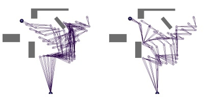
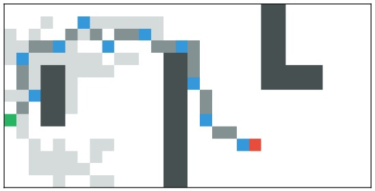

# Декомпозиция при поиске суб-оптимальных решений

В этом репозитории представлен код субоптимальных алгоритмов планирования, основанных на декомпозиции задачи. Такой подход полезен в больших задачах с большой среденей степенью ветвления.

## R*

В директории `rstar` представлена реализация алгоритма из [статьи](https://www.aaai.org/Papers/AAAI/2008/AAAI08-054.pdf) с "ленивой" детекцией дубликатов. В ноутбуке директории можно опробовать алгоритм с разынми параметрами на разных задачах, в директории также есть небольшое описание того, как с ним работать.

На изображении представлен результат работы алгоритма, путь выделен серым цветом, начало зеленым, конец - красным. Синие клетки - это вершины промежуточного графа алгоритма, светло серые - это состояния, раскрытые в процессе работы алгоритма. Видно, что раскрывается лишь часть состояний, которые раскрыл бы A*.

